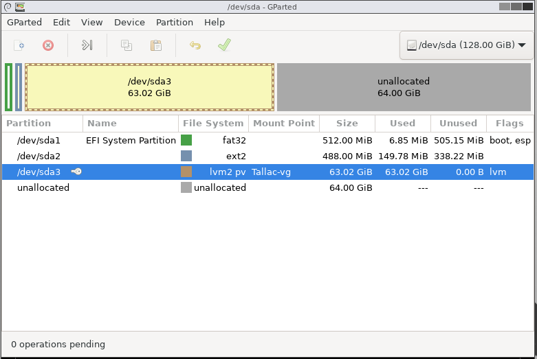

# Extending Space on a Logical Volume

# I. Problem

My Debian VM was generated on my TrueNAS hypervisor with 64 GB total. Most of it
was allocated on `/home` with 45GB. Barely any was allocated on `/var` with 4GB.
The issue -- Docker stores a lot of its data on `/var`... so 4 GB is not enough. 

```
root@Tallac:~# lvs
  LV     VG        Attr       LSize   Pool Origin Data%  Meta%  Move Log Cpy%Sync Convert
  home   Tallac-vg -wi-ao---- <44.93g
  root   Tallac-vg -wi-ao---- <12.02g
  swap_1 Tallac-vg -wi-ao---- 976.00m
  tmp    Tallac-vg -wi-ao---- 820.00m
  var    Tallac-vg -wi-ao----  3.93g
```

# II. Solution

## A. TrueNAS

So first turned off the VM. Then I went to TrueNAS > Datasets > my VM's zvol
and added an additional 64 GiB for a total of 128 GiB. Now I have extra 
unallocated space. I could have shrunk the home logical volume, but eh, I have
some resources to spare and this is just an exercise.

I then went back to Virutalization > Devices > then added a CD-ROM pointing to
the `/mnt/
Armatron/share/gparted-live-1.6.0-3-amd64.iso`, setting it to boot 
first. Started up the VM booting in to gparted.

## B. gparted





## Result
```
root@Tallac:~# lvs
  LV     VG        Attr       LSize   Pool Origin Data%  Meta%  Move Log Cpy%Sync Convert
  home   Tallac-vg -wi-ao---- <44.93g
  root   Tallac-vg -wi-ao---- <12.02g
  swap_1 Tallac-vg -wi-ao---- 976.00m
  tmp    Tallac-vg -wi-ao---- 820.00m
  var    Tallac-vg -wi-ao----  20.07g
```

## C. Extending and resizing

From here, it could be done back on the VM as root or from the gparted terminal.

To expand the space available for Docker, you can follow these steps:

1. Check the current size of the "var" logical volume:

```
lvdisplay Tallac-vg/var
```

2. Check the available free space in the "Tallac-vg" volume group:

```
vgdisplay Tallac-vg
```
Look for the "Free PE / Size" line to see the available free space.

3. If there is sufficient free space in the volume group, you can extend the 
"var" logical volume using the lvextend command. For example, to add ~16 GB of 
space to the "var" logical volume:

```
lvextend -L +16134MiB Tallac-vg/var
```

Note that there was a total of 64 GB of unallocated space, but I decided to only
use 16 GB as practice and in case more was needed elsewhere later.

4. After extending the logical volume, resize the filesystem to utilize the 
additional space:

```
resize2fs /dev/mapper/Tallac--vg-var
```

Note this actually threw an error and I needed to repair the LV by running this 
command first:

```
e2fsck -f /dev/mapper/Tallac--vg-var
``` 

5. Verify the resized filesystem

```
df -h /var
```

# III. Additional Background Info

## A. Logical Volume (LV), Volume Groups (VG), and Physical Volumes (PG)

Physical Volumes (PVs) are the building blocks of LVM. They are the actual physical disks or partitions that are initialized for use with LVM using the pvcreate command.
A Volume Group (VG) is created by combining one or more PVs using the vgcreate command. The VG acts as a pool of storage space from which Logical Volumes (LVs) can be created.
The storage capacity of a VG is the sum of the sizes of all the PVs that are part of it. For example, if you create a VG using two PVs of 100GB each, the total capacity of the VG would be 200GB.

In LVM, the hierarchy is as follows:

### Physical Volumes (PVs):

These are the actual physical disks or partitions that are initialized for use with LVM.
Multiple PVs can be combined to form a Volume Group (VG).
PVs are divided into small, fixed-size units called Physical Extents (PEs).


### Volume Groups (VGs):

A VG is a collection of one or more PVs that are pooled together to create a single logical storage unit.
VGs act as a pool of storage space from which Logical Volumes (LVs) can be created.
VGs can span across multiple PVs, allowing for flexibility and scalability in storage management.
The total storage capacity of a VG is the sum of the sizes of all the PVs within it.


### Logical Volumes (LVs):

LVs are created within a VG and are the logical partitions that are used to store data.
LVs are similar to traditional partitions but are more flexible and can be resized, moved, and snapshotted.
Multiple LVs can be created within a single VG, each with its own size and purpose.
LVs are composed of Logical Extents (LEs), which are mapped to the Physical Extents (PEs) of the underlying PVs.
Filesystems, such as ext4 or XFS, are created on top of LVs.

## B. Inspection

Other useful commands for inspection:
```
df -h # list all free space human readable
pvs # list all physical volumes
lvs # list all logical volumes
vgs # list all volume groups

```

## C. Etomology of commands

* `lvextend` - logical volume extend
* `resize2fs`: The name "resize2fs" stands for "resize second extended filesystem." It is a command specifically designed to resize ext2, ext3, and ext4 filesystems. The "2" in the name refers to the "second extended filesystem" (ext2), which was the successor to the original ext filesystem.
* `e2fsck`: The name "e2fsck" stands for "ext2 filesystem check." It is a filesystem consistency check and repair tool for ext2, ext3, and ext4 filesystems. The "e2" in the name refers to the "second extended filesystem" (ext2).

# IV. If there was no free space

## A. Add a disk
If there is no free space available in the volume group, you have a few options:

* Add a new physical volume (PV) to the volume group:

* If you have an unused disk or partition, you can initialize it as a new PV using pvcreate and add it to the "Tallac-vg" volume group using vgextend.
For example, if you have a new disk /dev/sdb:

```
pvcreate /dev/sdb
vgextend Tallac-vg /dev/sdb
```
## B. Shrink an existing volume like /home

```
umount /home
e2fsck -f /dev/mapper/Tallac--vg-home
resize2fs /dev/mapper/Tallac--vg-home 20G
lvreduce -L 20G Tallac-vg/home # shrink by 20G
lvextend -l +100%FREE Tallac-vg/var # extend all unallocated space rather specified
resize2fs /dev/mapper/Tallac--vg-var
mount /home
```
# V. Resources
* Claude: `Logical Volume Manager (LVM), Physical Volumes (PV), Volume Groups (VG), gparted`
* https://forums.truenas.com/t/howto-resize-a-linux-vms-llvm-virtual-disk-on-a-zvol/128
* https://www.truenas.com/community/resources/howto-resize-a-linux-vms-llvm-virtual-disk-on-a-zvol.174/
* https://www.truenas.com/community/threads/vm-wants-to-boot-from-installation-disc.113855/
* https://ubuntu.com/server/docs/how-to-manage-logical-volumes
* https://ubuntu.com/server/docs/about-logical-volume-management-lvm